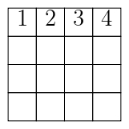
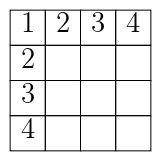
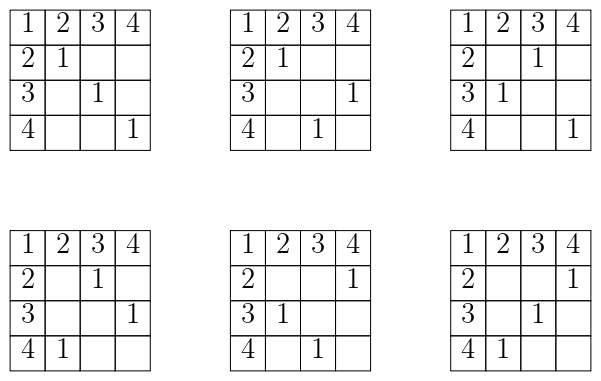

# Internet Olympiad 2023

## Vòng 3

### Bài 1

```{admonition} **Đề.**
Ở công viên cho trò chơi, với 5 dollar chúng ta được chơi 3 lượt
và được thưởng 1 viên kẹo. Nếu trả lại 2 lượt (không chơi) thì
chúng ta được trả lại 3 dollar đồng thời thêm 1 viên kẹo nữa.
Ở đây không có quy luật trao đổi khác. Một đứa trẻ vào chơi,
chỉ mang mỗi dollar. Kết thúc trò chơi, lượng dollar giảm
nhưng đứa trẻ có 50 viên kẹo (không còn lượt chơi sót lại). 
Hỏi đứa trẻ đã dùng bao nhiêu dollar cho trò chơi.
```

```{admonition} **Lời giải.**
:class: hint
Đặt $x$ là số dollar ban đầu đứa trẻ có, và $y$ là số lượt 5 dollar mà đứa trẻ mua, tương đương $y$ viên kẹo. Suy ra số lần chơi mà đứa trẻ bỏ lại 2 lượt là $50-y$. 

Nếu chơi hết 3 lượt thì đứa trẻ mất 5 dollar, nếu chơi 1 lượt (trả lại 2) thì đứa trẻ mất  $5-3=2$ dollar. Theo giả thiết là không còn lượt chơi sót lại, như vậy số lần chơi hết 3 lượt phải bằng bù lại số lần bỏ 2 lượt.

Nói cách khác $3y = 2(50-y)$. Vậy $y=20$ và $50-y=30$. Nghĩa là số lần đứa trẻ trả lại 2 lượt chơi là $3 \cdot 30 = 90$ dollar, và số tiền trả là $5 y = 100$. Như vậy để có 50 viên kẹo thì đứa trẻ cần $100 - 90 = 10$ dollar.
```

### Bài 2

```{admonition} **Đề.**
Gọi $x_0$ là cực tiểu địa phương của hàm số khả vi $f(x)$ thỏa mãn $f'(x) = 1 - x f^2(x)$ với mọi $x$. Hỏi có thể xác định nó là cực đại hay cực tiểu không?
```

```{admonition} **Lời giải.**
:class: hint
Có thể. Do $x_0$ là cực trị địa phương nên $f'(x_0) = 0$.
Suy ra $f'(x_0) = 1 - x_0 f^2(x_0) = 0$ và dễ thấy $x_0 = 0$
không là nghiệm của phương trình. Vậy ta có $f^2(x_0) = \frac{1}{x_0} > 0$.

Từ $f'(x) = 1 - x f^2(x)$ ta đạo hàm 2 vế thu được $f''(x) = -f^2(x) - 2xf(x) f'(x)$. 

Do $f'(x_0) = 0$ nên 

$$f''(x_0) = -f^2(x_0) - 2 x_0 \cdot f(x_0) f'(x_0) = -f^2(x_0) < 0.$$

Suy ra $x_0$ là cực đại.
```

### Bài 3

```{admonition} **Đề.**
Có bao nhiêu cách xếp 4 phần tử của 4 loại gạch khác nhau lên bảng 4x4 ô vuông sao cho ở mỗi hàng và mỗi cột có đúng 4 viên gạch thuộc 4 loại khác nhau?
```

```{admonition} **Lời giải.**
:class: hint
Ta cố định hàng đầu tiên của bảng là 1-2-3-4.



Tiếp theo ta bỏ các phần tử vào cột đầu theo thứ tự



Trong bảng $3 \times 3$ còn lại ta phân bố các phần tử 1 vào các hàng, ta có 6 cách xếp như sau:



Ta thấy rằng các trường hợp 1, 2, 4 và 6 sẽ có cách xếp các phần tử còn lại vào thỏa mãn. Nhưng trường hợp 3 và 5 sẽ bị đụng độ và không xếp được. Như vậy có 4 cách xếp.

Với mỗi cách xếp, ta có thể hoán vị 3 phần tử ở cột đầu tiên (hàng đầu cố định, hoán vị từ hàng 2 tới 4) nên ta có $3!$ cách chọn. Với mỗi cách cố định hàng đầu ta có $4 \cdot 3!$ cách chọn, và ta có $4!$ cách xếp hàng đầu tiên.

Như vậy kết quả là $4 \cdot 3! \cdot 4! = 576$.
```

### Bài 5

```{admonition} **Đề.**
Cho hàm $f(x)$ thỏa mãn $f(x) + \dfrac{1}{2} \sin f(x) = x$ với mọi $x \in \mathbb{R}$. Tính tích phân $\displaystyle{\int\limits_{0}^{\pi} f(x) \,dx}$.
```

```{admonition} **Lời giải.**
:class: hint
Đặt $t = f(x)$ thì $dt = f'(x)\,dx$. Sử dụng tích phân từng
phần với $u = f(x)$ và $dv = dx$ ta có $du = f'(x)\,dx$ và
$v = x$, suy ra:

$$\int\limits_{0}^{\pi} f(x) \, dx = x f(x) \Big|^\pi_0 - \int\limits_{0}^{\pi}x f'(x) \,dx$$

Từ giả thiết $f(x) + \dfrac{1}{2} \sin f(x) = x$, đạo hàm 2 vế ta có 

$$f'(x) + \dfrac{1}{2} \cos f(x) f'(x) = 1,$$

tương đương với $f'(x) = \dfrac{2}{2 + \cos f(x)}$ mà $-1 \leqslant \cos f(x) \leqslant 1$ với mọi $x \in \mathbb{R}$ nên $f'(x) > 0$ với mọi $x \in \mathbb{R}$. Nghĩa là hàm đồng biến trên $\mathbb{R}$.

Từ đó, với mỗi $x \in \mathbb{R}$ tồn tại duy nhất $f(x)$ tương ứng với nó. Ta thay $x = 0$ và $f(x) = 0$ vào phương trình thì 
thấy thỏa mãn. Như vậy $f(0) = 0$. Tương tự $f(\pi) = \pi$.
Do đó $x f(x) \Big|^\pi_0 = \pi^2$.

Cũng từ đó ta có 

$$
    \displaystyle{\int\limits_{0}^{\pi} x f'(x)\,dx = \int\limits_{0}^{\pi} x \, dt = \int\limits_{0}^{\pi} (t + \dfrac{1}{2} \sin t)\,dt = \dfrac{\pi^2}{2} + 1}.
$$

Tóm lại $\displaystyle{\int\limits_{0}^{\pi}f(x)\,dx = \pi^2 - (\dfrac{\pi^2}{2} + 1)
= \frac{\pi^2}{2} - 1}$.
```

### Bài 6

```{admonition} **Đề.**
Trong không gian cho tam giác vuông cân $ABC$. 

Gọi $A_1 B_1 C_1$ là hình chiếu của tam giác $ABC$ lên mặt phẳng nào đó ($A_1$, $B_1$, $C_1$
lần lượt là hình chiếu của $A$, $B$ và $C$ lên mặt phẳng đó).
Biết rằng $A_1 B_1 C_1$ cũng là tam giác vuông cân. Tìm mọi giá
trị có thể của tỉ số giữa độ dài cạnh góc vuông $AB$ và cạnh
góc vuông $A_1 B_1$.
```

```{admonition} **Lời giải.**
:class: hint
Không mất tính tổng quát, ta chọn $A_1$ ở gốc tọa độ $Oxyz$, 
$B_1 = (1, 0, 0)$ và $C_1 = (0, 1, 0)$. Khi đó $A_1$ là hình
chiếu của $A$ lên mặt phẳng $Oxy$ nên $A = (0, 0, 1)$. Tương
tự, $B_1$ là hình chiếu của $B$ lên mặt $Oxy$ nên $B$ nằm
trên đường thẳng qua $B$ song song $Oz$, vậy $B = (1, 0, x)$.
Tương tự $C = (0, 1, y)$.

Từ giả thiết $AB$ và $A_1 B_1$ là cạnh góc vuông, vậy $\angle A = 90$
hoặc $\angle B = 90$.

Ta có các vector $\overline{AB} = (1, 0, x-1)$, $\overline{AC} = (0, 1, y-1)$, $\overline{BC} = (-1, 1, y-x)$.
Tương tự $\overline{A_1 B_1} = (1, 0, 0)$, $\overline{A_1 C_1} = (0, 1, 0)$, $\overline{B_1 C_1} = (-1, 1, 0)$.

*Trường hợp 1.* Tam giác $ABC$ vuông tại $A$. Khi đó
$\overline{AB} \cdot \overline{AC} = 0$ và $\lvert \overline{AB}
\rvert = \lvert \overline{AC} \rvert$. Tương đương với $(x-1)(y-1) = 0$
và $1 + (x-1)^2 = 1 + (y-1)^2$. Suy ra $x = y = 1$. Như vậy 
$\dfrac{AB}{A_1 B_1} = 1$.

*Trường hợp 2.* Tam giác $ABC$ vuông tại $B$. Khi đó
$\overline{AB} \cdot \overline{BC} = 0$ và $\lvert \overline{AB} \rvert = \lvert \overline{BC} \rvert$. Tương đương với $-1 + (x-1)(y-x) = 0$ và $1 + (x-1)^2 = 2 + (y-x)^2$. Ta thấy $x = 1$ không là nghiệm của phương trình đầu, nên $y - x = \dfrac{1}{x-1}$. Thay vào phương trình thứ hai và biến đổi ta có

$$\begin{align*}
    & 1 + (x-1)^2 = 2 + \frac{1}{(x-1)^2} \\ 
    \Leftrightarrow & (x-1)^4 - (x-1)^2 - 1 = 0 \\ 
    \Leftrightarrow & (x-1)^2 = \frac{1+\sqrt{5}}{2}
\end{align*}$$

mà $AB = \sqrt{1 + (x-1)^2} = \sqrt{1 + \dfrac{1 + \sqrt{5}}{2}}
= \dfrac{1 + \sqrt{5}}{2}$ và $A_1 B_1 = 1$ nên tỉ số là 
$\dfrac{AB}{A_1 B_1} = \dfrac{1 + \sqrt{5}}{2}$

Như vậy có 2 đáp án thỏa mãn là 1 và $\dfrac{1 + \sqrt{5}}{2}$.
```

### Bài 7

```{admonition} **Đề.**
Cho hai ma trận vuông $A$ và $B$ sao cho $B^2 = 0$ và
$A^2 B + B A^2 = 2A^3$. Chứng minh rằng với mỗi ma trận
$A$ như vậy thì $A^{12} = 0$.
```

```{admonition} **Lời giải.**
:class: hint
Từ giả thiết $A^2 B + B A^2 = 2A^3$, nhân hai vế của phương
trình cho $B$ vào bên trái thì ta có $B A^2 B = 2BA^3$. Tương
tự nếu nhân $B$ vào bên phải thì $B A^2 B = 2A^3 B$. Như vậy
$BA^3 = A^3 B$.

Tiếp theo nhân hai vế $A^2 B + B A^2 = 2A^3$ vào bên trái và bên phải cho $A^2$ thì $A^4 B + A^2 B A^2 = 2A^5$ và $A^2 B A^2 + BA^4 = 2A^5$. Như vậy $A^4 B = B A^4$.

Khi đó $A^5 B = A \cdot A^4 B = A \cdot BA^4 
= A \cdot BA^3 \cdot A = A \cdot A^3 B \cdot A 
= A^4 B \cdot A = B A^4 A = B A^5$. Như vậy $A^5 B = B A^5$.

Bình phương hai vế $A^2 B + BA^2 = 2A^3$ ta có

$$\begin{align*}
    4A^6 & = A^2 B A^2 B + A^2B BA^2 + BA^2 A^2 B + BA^2 BA^2 \\
        & = A^2 B A^2 B + BA^4 B + BA^2 BA^2
\end{align*}$$

mà $BA^4B = A^4 B B = 0$ nên $4A^6 = A^2B A^2B + BA^2 BA^2$.

Tiếp theo, từ $A^2 B + BA^2 = 2A^3$ ta có

$$\begin{align*}
    A^2B A^2B & = A^2B (2A^3 - BA^2) = 2 A^2 B A^3 - A^2 B \cdot BA^2
            \\ & = 2 A^2 A^3 B - 0 = 2 A^5 B
\end{align*}$$

Tương tự

$$\begin{align*}
    BA^2 BA^2 & = (2A^3 - A^2B) BA^2 = 2A^3 BA^2 - A^2B \cdot BA^2
            \\ & = 2 BA^3 \cdot A^2 - 0 = 2BA^5
\end{align*}$$

Mà $A^5 B = BA^5$ nên $4A^6 = 2A^5B + 2BA^5 = 4A^5B$. Suy ra
$A^6 = A^5 B$. Cuối cùng $A^{12} = A^6 \cdot A^6 = A^5B \cdot BA^5
= 0$. Điều phải chứng minh.
```

### Bài 8

```{admonition} **Đề.**
Cho ba số dương $a$, $b$, $c$ sao cho $\sin a \cdot \sin b \cdot \sin c = \dfrac{3}{\pi} \cdot abc$. Chứng minh rằng 
$a + b + c > \dfrac{\pi}{6}$.
```

```{admonition} **Lời giải.**
:class: hint
Do $a$, $b$, $c$ dương nên ta có thể chia 2 vế cho $abc$ và có
$\dfrac{\sin a}{a} \cdot \dfrac{\sin b}{b} \cdot \dfrac{\sin c}{c} = \dfrac{3}{\pi}$.

Xét hàm $f(x) = \ln \left(\dfrac{\sin x}{x}\right)$. Do $a$, $b$, $c$ dương nên vế trái cũng dương, do đó ta chỉ cần xét các số trong khoảng $\left(0, \frac{\pi}{2}\right)$ là đủ. Khi đó, đặt

$$f(x) = \begin{cases} \ln\left(\frac{\sin x}{x}\right), \quad
    & 0 < x < \frac{\pi}{2} \\
    0, \quad & x = 0
\end{cases}$$

Từ giả thiết suy ra:

$$\begin{align*}
    f(a) + f(b) + f(c) & = \ln \left(\frac{\sin a}{a}\right) 
    + \left(\frac{\sin b}{b}\right) + \left(\frac{\sin c}{c}\right) \\
    & = \ln\left(\frac{\sin a}{a} \cdot \frac{\sin b}{b} 
    \cdot \frac{\sin c}{c}\right) \\
    & = \ln\left(\frac{3}{\pi}\right) = f\left(\frac{\pi}{6}\right)
\end{align*}$$

Ta thấy $e^{f(x)} = \dfrac{\sin x}{x}$. Đạo hàm hai vế suy ra

$$
    e^{f(x)} f'(x) = \left(\dfrac{\cos x}{x} - \dfrac{\sin x}{x^2}\right).
$$

Vậy:

$$f'(x) = \left(\frac{\cos x}{x} - \frac{\sin x}{x^2}\right)
\cdot \frac{x}{\sin x} = \cot x - \frac{1}{x}$$

Và đạo hàm cấp hai:

$$f''(x) = \frac{-1}{\sin^2 x} + \frac{1}{x^2}$$

mà trên khoảng $(0, \dfrac{\pi}{2})$ thì $\sin x < x$
nên $f''(x) < 0$ với mọi $x \in (0, \dfrac{\pi}{2})$.
Do đó $f'(x)$ nghịch biến biến trên $(0, \dfrac{\pi}{2})$,
và do $\dfrac{\sin x}{x}$ nghịch biến trên $(0, \dfrac{\pi}{2})$ nên $f(x)$ cũng nghịch biến trên $(0, \dfrac{\pi}{2})$.

Không mất tính tổng quát giả sử $a \leqslant b \leqslant c$.
Theo định lý Lagrange (khúc này hack não lắm!!!) thì
tồn tại số $\xi_1 \in (0, a)$ sao cho $f(a) - f(0) = 
f'(\xi_1) \cdot (a - 0) \Leftrightarrow f(a) - f(0) = f'(\xi_1) \cdot a$.

Tương tự tồn tại số $\xi_2 \in (a, a+b)$ sao cho
$f(a+b) - f(b) = f'(\xi_2) \cdot (a + b - b) = f'(\xi_2) \cdot a$.

Do $\xi_1 < \xi_2$ và $f'(x)$ nghịch biến nên $f'(\xi_1) > f'(\xi_2)$.

Suy ra $f(a) - f(0) > f(a+b) - f(b)$, hay $f(a) + f(b) > f(a+b) + f(0)$.

Chứng minh tương tự ta cũng có $f(a+b) + f(c) > f(a+b+c) + f(0)$.

Như vậy 

$$f\left(\frac{\pi}{6}\right) = f(a) + f(b) + f(c) > f(a+b) + f(0) + f(c) > f(a+b+c) + f(0) + f(0) > f(a + b + c)$$

Do $f(x)$ nghịch biến nên $a + b + c > \dfrac{\pi}{6}$ là điều
cần chứng minh.
```

### Bài 10

```{admonition} **Đề.**
Cho đa thức với hệ số nguyên

$$P_n(x) = a_n x^n + a_{n-1} x^{n-1} + \ldots + a_1 x + a_0$$

Biết rằng $a_n$ là số lẻ, và $P_n(k)$, $P_n(k+1)$ là các số
lẻ với $k$ nào đó. Chứng minh rằng đa thức không có nghiệm hữu tỷ.
```

```{admonition} **Lời giải.**
:class: hint
Giả sử đa thức có nghiệm hữu tỷ $\dfrac{p}{q}$ với $p$ và $q$
nguyên tố cùng nhau (phân số tối giản). Khi đó 
$P_n(x) = \left(x - \dfrac{p}{q}\right) \cdot Q_{n-1}(x)
= (qx - p) \left(\dfrac{1}{q} Q_{n-1}(x)\right)$.
Do $p$ và $q$ nguyên tố cùng nhau nên $\dfrac{1}{q} Q_{n-1}(x)$
cũng là một đa thức hệ số nguyên. Ta nhận thấy rằng

$$\begin{align*}
    P_n(x) & = a_n x^n + a_{n-1} x^{n-1} + \ldots + a_1 x + a_0 \\
& = (qx - p) \left(\dfrac{a_n}{q} x^{n-1} + \ldots + \dfrac{-a_0}{q}\right)
\end{align*}$$

Ở đây ta có thể xét hệ số bậc cao nhất và thấp nhất, và từ
đó suy ra $\dfrac{a_n}{q}$ và $\dfrac{a_0}{q}$ là các số nguyên.

Vậy với số nguyên $m$ bất kì thì $\dfrac{P_n(m)}{qm - p} = N(m)$ cũng là một số nguyên. Mà từ giả thiết $a_n$, $P_n(k)$ và $P_n(k+1)$ là các số lẻ thì $qk - p = 2m_1 - 1$ (số lẻ không thể chia hết cho số chẵn). Tương tự $q(k+1) - p = 2m_2 - 1$.

Trừ vế theo vế ta có $(2m_2 - 1) - (2m_1 - 1) = 
2 (m_2 - m_1) = q$. Như vậy $q$ là số chẵn, tuy nhiên do 
$\dfrac{a_n}{q}$ là số nguyên và $a_n$ là số lẻ nên $q$ 
phải là số lẻ, mâu thuẫn. 

Theo phản chứng, đa thức không có nghiệm hữu tỷ.
```